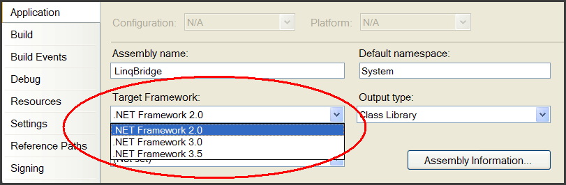

# LINQBridge

You might already have discovered that **LINQ is addictive**: once you're
accustomed to solving problems through slick functional queries, it really
hurts being forced back to the imperative style of C# 2.0!

LINQ's query operators are implemented in .NET Framework 3.5. And here lies a
difficulty: **you might be unsuccessful in demanding that all your customers
install Framework 3.5 right away**. So what does this mean if you want to code
in C# 3.0 and write LINQ queries?

The good news is that there is a solution. It relies on two things:

* [Visual Studio 2008's multi-targeting feature](http://msdn.microsoft.com/en-us/library/bb398197(VS.90).aspx)
* [`LinqBridge.dll`](https://www.nuget.org/packages/LinqBridge/) (a 60KB assembly)

With Visual Studio's multi-targeting and LINQBridge, you'll be able to write
local ([LINQ to Objects]) queries using the full power of the C# 3.0 compiler
and yet your programs will require only Framework 2.0.

**LINQBridge is a re-implementation of all the standard query operators in
Framework 3.5's [`System.Linq.Enumerable`][Enumerable] class.** It's designed
to work with the C# 3.0 compiler, as used by Visual Studio 2008. LINQBridge
comprises a [LINQ to Objects] API for running local queries. (It doesn't
include an implementation of [LINQ to SQL], nor [LINQ to XML]; a good
compromise can be to force Framework 3.5 out to just the server machines,
allowing LINQ to SQL to be used where it's needed most).

LINQBridge also includes Framework 3.5's generic [`Func`][Func] and
[`Action`][Action] delegates, as well as [`ExtensionAttribute`][Extension],
allowing you to use C# 3.0's extension methods in Framework 2.0.

In fact LINQBridge lets you use nearly all of the features in C# 3.0 with Framework 2.0, including extension methods, lambda functions and query comprehensions. The only feature it does not support is compiling lambdas to expression trees (i.e., [Expression<TDelegate>](http://msdn.microsoft.com/en-us/library/bb335710.aspx)).


## How does it work?

First, it's important to understand that C# 3.0 and Framework 3.5 are designed
to work with CLR 2.0, the same CLR version that Framework 2.0 uses. This means
that the C# 3.0 compiler emits IL code that runs on the same virtual machine
as before.

This makes Framework 3.5 additive, just as Framework 3.0 was additive,
comprising additional assemblies that enhance the existing 2.0 Framework and
CLR. So there's nothing to stop us from writing our own assemblies that do the
work of Framework 3.5 (at least, the critical bits required for local LINQ
queries).

But, you might ask, don't LINQ queries depend on Framework 3.5? Strictly
speaking, they don't. C# 3.0 expects that certain method signatures be
present, which Framework 3.5 just happens to provide. For example, consider
the following LINQ query:

```c#
int[] numbers = { 5, 15, 7, 12 };

var query =
  from n in numbers
  where n > 10
  orderby n
  select n * 10;
```

In compiling this, C# 3.0 first translates it to:

```c#
var query = numbers
  .Where (n => n > 10)
  .OrderBy (n => n)
  .Select (n => n * 10);
```

The compiler then looks for `Where`, `OrderBy` and `Select` methods. The
critical thing is that it can find appropriately named methods with the
correct signatures (typically extension methods). **But it doesn't matter what
assembly the methods come from.** LINQBridge simply provides another source of
these methods that are functionally identically to those implemented in the
Framework 3.5 assemblies.


## How to use LINQBridge

LINQBridge requires Visual Studio 2008 (or the standalone C# 3.0 compiler, if
you're keen). First, go to project properties, and change the Target Framework
to 2.0 or 3.0:



This is a safeguard that prevents you from accidentally referencing Framework
3.5 assemblies. If your project already references `System.Core`, the
reference will be greyed out (you can safely delete it).

The next step is to add a reference to `LinqBridge.dll`.

That's all there is to it, now you can start writing LINQ queries!

When all of your clients later upgrade to Framework 3.5, you can upgrade your
project simply by changing the Target Framework back to 3.5 and replacing the
LINQBridge reference with `System.Core`. LINQBridge uses the standard LINQ
namespaces, so no code edits will be required.


## What if Framework 3.5 is Installed?

The presence of Framework 3.5 does not impede LINQBridge in any way. If your
project references LINQBridge during compilation, then it will bind to
LINQBridge's query operators; if it references `System.Core` during
compilation, then it will bind to Framework 3.5's query operators.


## Can I use LINQBridge with C# 2.0 and Studio 2005?

You can, but the query operators will be awkward to use without lambda
expressions, extension methods, query syntax, etc.


  [LINQ to Objects]: http://msdn.microsoft.com/en-us/library/bb397919.aspx
  [LINQ to SQL]: http://msdn.microsoft.com/en-us/library/bb386976.aspx
  [LINQ to XML]: http://msdn.microsoft.com/en-us/library/bb387098.aspx
  [Enumerable]: http://msdn.microsoft.com/en-us/library/system.linq.enumerable.aspx
  [Func]: http://msdn.microsoft.com/en-us/library/bb534960.aspx
  [Action]: http://msdn.microsoft.com/en-us/library/018hxwa8.aspx
  [Extension]: http://msdn.microsoft.com/en-us/library/system.runtime.compilerservices.extensionattribute.aspx
